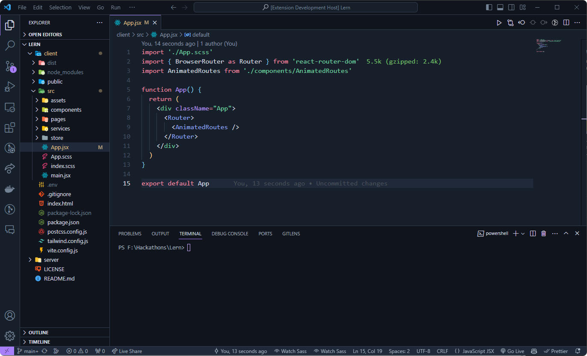

# Prizm VSCode Theme

## Description

Prizm is a sleek and minimalistic dark theme for Visual Studio Code, inspired by the modern aesthetics of Google IDX. With a carefully curated color palette and a focus on readability, Prizm enhances your coding experience by combining style and functionality seamlessly.

## Installation

1. Open Visual Studio Code
2. Go to Extensions
3. Search for "Prizm"
4. Click Install
5. Select Prizm as your color theme in VSCode settings

## Feedback

Feel free to [submit issues](https://github.com/yourusername/prizm-vscode-theme/issues) or [create pull requests](https://github.com/yourusername/prizm-vscode-theme/pulls) to contribute to the development of Prizm. Your feedback is highly appreciated!

## License

This project is licensed under the [MIT License](LICENSE.md).

---

**Experience a futuristic edge with Prizm! 🚀**